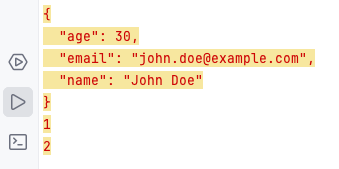

# wang-sitong/p

[中文文档](./README_ZH.md)

### Golang more comfortable and beautiful printing data

```
go get github.com/wang-sitong/p
```

### Examples:
```
import (
	"github.com/wang-sitong/p"
)
func main() {
	data := map[string]interface{}{
		"name":  "John Doe",
		"age":   30,
		"email": "john.doe@example.com",
	}
	p.R(data)
	p.R(1)
	p.D(2)
	p.R(3)
	
}
```


